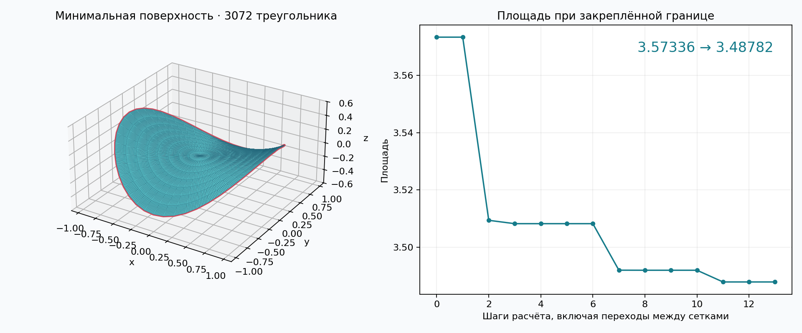
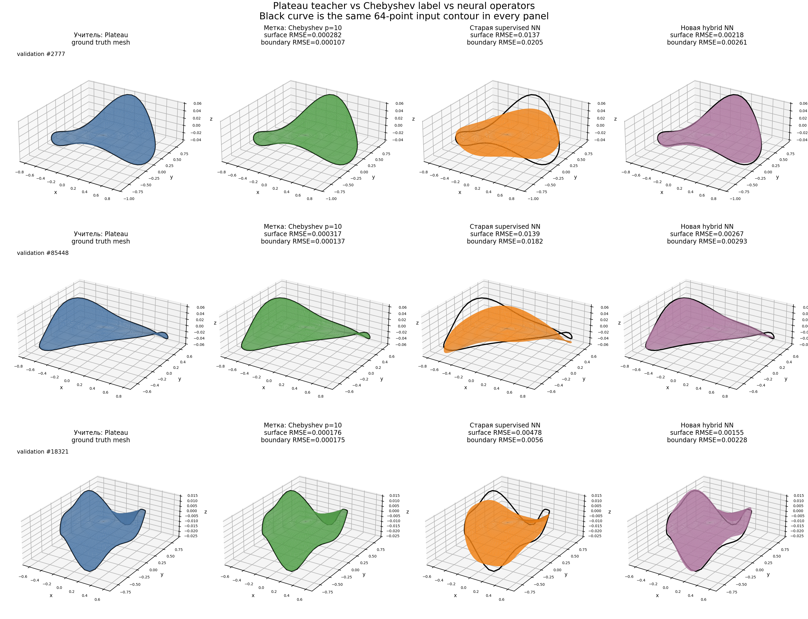

# Минимальная поверхность по заданной границе

Численный проект на **C++17**: построение треугольной поверхности и уменьшение её площади при неподвижной границе. Можно задать контур точками или формулой, загрузить готовую сетку либо дискретизировать исходную поверхность `z = f(x, y)`. Режим `graph` изменяет высоты, а экспериментальный режим `spatial` свободно перемещает внутренние вершины в трёхмерном пространстве.

Результат — сетка OBJ, автономная интерактивная HTML-визуализация и CSV с историей площади. C++-часть использует только стандартную библиотеку; для ввода формул нужен Python 3.9+ без дополнительных пакетов.

В репозитории также есть экспериментальный Python/PyTorch-прототип: C++-решатель
генерирует пары «пространственный контур → минимальная поверхность», а условная
нейросеть учится предсказывать локальное неявное поле либо непосредственно
коэффициенты аналитической формулы и площадь.



## Текущий исследовательский результат

На 100 000 решениях C++-учителя обучен спектральный оператор
`контур → 286 коэффициентов Чебышёва полной степени 10`. Восемь точных
поворотов вокруг оси `Z` дают 800 000 обучающих пар без повторного решения
задачи Плато. Hybrid v2 сочетает стандартизованную ошибку коэффициентов с
граничным, Eikonal, mean-curvature и graph-loss.



Средние ошибки на трёх воспроизводимо выбранных контурах validation split
(`seed=2026`):

| Модель | Surface z RMSE | Boundary z RMSE |
|---|---:|---:|
| Chebyshev fit учителя | 0.000259 | 0.000140 |
| прежняя supervised NN | 0.010803 | 0.014741 |
| **hybrid v2** | **0.002132** | **0.002606** |

На этой небольшой визуальной выборке hybrid-модель улучшает поверхность в
`5.07x`, а прохождение через границу в `5.66x` относительно baseline. Полный
validation каждого epoch содержит 40 336 примеров; его история, компактный
inference-checkpoint и численные результаты опубликованы в
[`artifacts/spectral-hybrid-v2`](artifacts/spectral-hybrid-v2/README.md).

Чистый forward занимает около `1.6–2.0 ms` на Apple MPS против примерно `21 ms`
для C++-решателя в локальном benchmark. Текущее извлечение явной сетки нулевого
уровня пока занимает `0.58–0.74 s` и остаётся главным bottleneck; эти времена
не смешиваются, чтобы не завышать достигнутое ускорение.

## Постановка и область применимости

Для закреплённого замкнутого контура ищется поверхность, минимизирующая площадь. В дискретной модели:

```text
A = sum_T 0.5 * |(p1 - p0) × (p2 - p0)|.
```

В режиме `graph`, выбранном по умолчанию, поверхность представляется **графиком высоты над плоскостью**. Проекции вершин и связность сетки фиксированы, меняются только высоты внутренних вершин. Функционал площади выпуклый по высотам, поэтому получается устойчивое и однозначное дискретное решение.

В режиме `spatial` каждая внутренняя вершина изменяет все координаты `x,y,z`. Такой расчёт принимает готовые сетки с нависаниями и вертикальными участками, которые нельзя представить одной функцией высоты. Граница и топология остаются фиксированными, а внутренние рёбра могут перестраиваться ради качества треугольников. Это невыпуклая оптимизация: результат может зависеть от начальной сетки и соответствовать локальному стационарному решению.

Поддерживается одна связная поверхность топологии диска с одной граничной петлёй. Построение начальной сетки только по контуру пока требует простой выпуклой границы в выбранной проекции. Готовая OBJ-сетка в режиме `spatial` может иметь нависания. Узлы, отверстия, несколько граничных петель и изменение топологии пока не реализованы.

Треугольная поверхность непрерывна, но кусочно-плоская: нормаль меняется на рёбрах. Она **приближает** гладкую поверхность при сгущении, а не является точной гладкой параметризацией. Дискретный критерий остановки не доказывает точность относительно непрерывного решения — её проверяют сравнением сеток.

## Быстрый запуск

Нужны CMake 3.10+ и компилятор C++17:

```bash
cmake -S . -B build -DCMAKE_BUILD_TYPE=Release
cmake --build build
./build/triangulation --output surface
```

Без входного файла рассчитывается неплоский замкнутый контур:

```text
x(t) = cos(t)
y(t) = sin(t)
z(t) = 0.35 cos(2t),  0 ≤ t < 2π
```

Создаются `surface.obj`, `surface.html`, `surface.csv`. Откройте HTML в обычном браузере: мышью можно вращать поверхность, колесом менять масштаб, флажком скрывать рёбра. Интернет и внешние библиотеки визуализации не нужны. Красным выделена закреплённая граница. OBJ можно открыть в редакторе трёхмерных сеток.

HTML показывает весь сохранённый ход расчёта от исходной сетки до результата. В нём есть запуск и пауза, ползунок времени, четыре скорости, наложение исходной поверхности и текущие значения площади, невязки, уровня сгущения и итерации. Кнопка **«Скачать WebM»** записывает анимацию средствами браузера; если браузер не поддерживает `MediaRecorder` или `canvas.captureStream`, кнопка остаётся недоступной.

Готовый наглядный пример — [`examples/dome-animation.html`](examples/dome-animation.html): выпуклый купол с закреплённой квадратной границей плавно превращается в плоскую минимальную поверхность. Файл автономный: его можно скачать, открыть в браузере и сразу сохранить анимацию в WebM. Рядом лежит уже записанное [`dome-animation.webm`](examples/dome-animation.webm).

Пример пространственного режима с нависанием:

```bash
./build/triangulation --mesh examples/overhang.obj \
  --mode spatial --refine 0 --output spatial-overhang
```

Та же сетка в режиме `graph` отклоняется, поскольку часть треугольников переворачивается в выбранной проекции. Готовая анимация лежит в [`examples/spatial-overhang.html`](examples/spatial-overhang.html).

При переходе на следующий уровень сетка мгновенно сгущается, затем координаты плавно интерполируются между шагами оптимизации. Само сгущение не меняет геометрию поверхности. Чтобы HTML не разрастался без ограничения на очень больших задачах, программа хранит не более 250000 наборов координат: первый и последний доступные кадры сохраняются, часть промежуточных может быть отброшена.

## Способы ввода

### 1. Контур из точек

Файл содержит по три координаты `x,y,z` или `x y z` в строке. Точки идут последовательно вдоль границы. Первая точка может быть точно повторена в конце; замыкание последнего ребра выполняется автоматически. Поддерживаются пустые строки и комментарии `#`. Десятичный разделитель — точка, строки заголовка без `#` не допускаются.

```bash
./build/triangulation --contour examples/wavy-circle.csv --refine 3 --output surface
```

Между точками граница линейная. Если известна гладкая формула, увеличивайте число её исходных отсчётов: сгущение сетки само по себе добавляет точки на существующих прямых рёбрах и не восстанавливает кривую.

### 2. Параметрическая формула контура

```bash
python3 tools/formula.py contour \
  --x 'cos(t)' --y 'sin(t)' --z '0.35*cos(2*t)' \
  --samples 64 --output contour.csv
./build/triangulation --contour contour.csv --output surface
```

По умолчанию `t` меняется от 0 до 2π; границы задаются числовыми `--start` и `--end`. Значения параметризации на концах должны совпадать с относительной точностью `1e-8`. Конечная точка в CSV не дублируется.

### 3. Формула исходной поверхности

Например, купол над квадратом:

```bash
python3 tools/formula.py surface \
  --z '0.4*(1-x*x)*(1-y*y)' \
  --x-range -1 1 --y-range -1 1 --steps 20 --output initial.obj
./build/triangulation --mesh initial.obj --normal 0 0 1 --refine 1 --output surface
```

Граница этого купола лежит в плоскости `z=0`, поэтому минимумом будет плоский квадрат площади 4. **Формула задаёт начальную поверхность, а не ограничение на её последующее изменение.** Если необходимо сохранить всю формулу, достаточно дискретизации без запуска минимизатора.

Для неплоской границы можно взять `--z '0.3*(x*x-y*y)'`. Для известного минимального графика Шерка — `--z 'log(cos(y)/cos(x))'` на диапазонах `[-0.65, 0.65]`.

Формулы допускают `+ - * / **`, скобки, числа, константы `pi`, `e`, функции `sin`, `cos`, `tan`, `asin`, `acos`, `atan`, `sinh`, `cosh`, `tanh`, `exp`, `log`, `sqrt`, `abs`. У функции один аргумент. Переменные — `t` для контура, `x,y` для поверхности. Выражения разбираются собственным интерпретатором дерева Python AST: импортов, `eval`, доступа к атрибутам или выполнения Python-кода нет.

Общие параметрические поверхности `r(u,v)` и неявные уравнения `F(x,y,z)=0` пока не поддерживаются.

### 4. Готовая треугольная сетка

```bash
./build/triangulation --mesh initial.obj --normal 0 0 1 --refine 0 --output result
```

Поддерживаются строки OBJ `v x y z` и треугольные `f`, включая индексы вида `v/vt/vn` и отрицательные индексы. Вершины должны быть объявлены до использующих их граней. Текстуры и материалы не влияют на расчёт. Грани-многоугольники нужно заранее триангулировать.

Рёбра, принадлежащие одной грани, образуют закреплённую границу. Проверяются связность, ориентация, повторные грани, единственность границы и топология диска. В режиме `graph` дополнительно требуются положительные площади всех проекций; режим `spatial` вместо этого проверяет пространственную невырожденность граней. Замкнутую оболочку нельзя минимизировать без дополнительного ограничения: она могла бы схлопнуться; такой ввод отклоняется.

## Плоскость и параметры расчёта

Если `--normal` не задана, нормаль плоскости вычисляется по векторной площади граничного многоугольника. Это эвристический выбор системы координат, а не поиск лучшей возможной проекции. При отказе для контура, который имеет подходящую проекцию, можно явно задать её нормаль. Для `z=f(x,y)` используйте `--normal 0 0 1`.

| Параметр | По умолчанию | Значение |
|---|---|---|
| `--contour PATH` | демонстрационный контур | CSV/TXT с координатами |
| `--mesh PATH` | нет | Начальная треугольная сетка OBJ; несовместим с `--contour` |
| `--mode graph\|spatial` | `graph` | Высоты над плоскостью или свободное движение внутренних вершин в 3D |
| `--remesh-passes N` | `0` для `graph`, `3` для `spatial` | Число проходов переворота рёбер и тангенциального сглаживания, 0–100 |
| `--normal nx ny nz` | автоматически | Направление изменения высот; ненулевой конечный вектор |
| `--refine N` | 3 | Число сгущений, 0–6; каждое делит треугольник на четыре |
| `--iterations N` | 100 | Максимум шагов Ньютона на уровень, 1–10000 |
| `--tolerance E` | `1e-9` | Максимальная абсолютная компонента градиента по свободным высотам в нормированных координатах |
| `--output PREFIX` | `surface` | Префикс OBJ, HTML и CSV; каталог должен существовать |

Расчёт ведётся после переноса и нормирования входа; OBJ и площадь возвращаются в исходных единицах. Лимит — 200000 треугольников. При превышении лимита дальнейшее сгущение прекращается с ошибкой. Новые граничные точки остаются на прежней ломаной; исходные граничные точки сохраняются с точностью округления при нормировании и экспорте.

Коды завершения: `0` — достигнут критерий остановки; `1` — ошибка входа, параметров или записи; `2` — оптимизация не сошлась. В последнем случае сохраняется промежуточная сетка, дальнейшее сгущение не выполняется. Малое изменение площади само по себе не используется как признак сходимости.

## Метод

1. Для контура строится веер треугольников к средней точке; связность OBJ используется как начальная.
2. В режиме `graph` вычисляются аналитические градиент и гессиан площади по высотам. Шаг Ньютона приближённо решается методом сопряжённых градиентов.
3. В режиме `spatial` вычисляется полный аналитический градиент площади по координатам вершин. Направление определяется методом L-BFGS с памятью восьми шагов.
4. Внутреннее ребро переворачивается, только если новая диагональ улучшает худший из двух треугольников, сохраняет ориентацию и не увеличивает площадь. Конфликтующие перевороты разделяются по проходам.
5. Тангенциальное сглаживание перемещает внутренние вершины к центрам соседей вдоль локальной касательной плоскости. Принимаются только шаги, которые улучшают среднее качество, не ухудшают минимум и меняют площадь не более чем на `1e-8` относительно текущей.
6. После изменения сетки минимизатор запускается повторно. Поиск шага по условию Армихо принимает только уменьшение площади; слишком сильное уменьшение площади отдельного треугольника блокируется.
7. Сетка сгущается общими серединами рёбер, после чего весь цикл повторяется.

Качество треугольника измеряется безразмерной величиной `q = 4√3 A / (a²+b²+c²)`: единица соответствует равностороннему треугольнику, ноль — вырожденному. В режиме `graph` положительная площадь проекций сохраняется, поскольку плоские координаты не меняются. В пространственном режиме дополнительно проверяется ненулевой размер каждого треугольника. Самопересечения всей поверхности, адаптивное сгущение и оценка ошибки по кривизне пока не реализованы.

Общий подход к минимизации площади триангулированных поверхностей с ограничениями описан в работе К. Бракке [The Surface Evolver](https://www.kenbrakke.com/papers/downloads/SurfaceEvolver_ExpMath.pdf). Этот проект — самостоятельный небольшой решатель для более узкого класса графиков, не реализация всех возможностей Surface Evolver.

## Проверки

```bash
ctest --test-dir build --output-on-failure
```

Если при конфигурации найден Python 3.9+, CTest также запускает проверки формул и командного интерфейса. Их можно вызвать отдельно:

```bash
python3 -m unittest discover -s tests -p 'test_formula.py'
python3 tests/check_cli.py ./build/triangulation
```

Проверяются градиент и гессиан режима `graph`, полный пространственный градиент конечными разностями, неподвижность границы, убывание площади, плоское решение, сетка с нависанием, инвариантность относительно переноса/поворота/масштаба и уменьшение ошибки на графике Шерка при сгущении. Отдельно проверяются ошибки формул и запрещённый синтаксис. Тесты выполняются и в Release-сборке. GitHub Actions повторяет сборку и весь набор CTest на Linux и macOS.

## Эксперимент с нейросетью

Сначала соберите решатель и создайте небольшой настоящий датасет:

```bash
cmake -S . -B build -DCMAKE_BUILD_TYPE=Release
cmake --build build -j2
python3 scripts/generate_dataset.py --smoke --output-dir dataset/smoke
```

Затем установите ML-зависимости в отдельное окружение и выполните короткий запуск:

```bash
python3 -m venv .venv-ml
source .venv-ml/bin/activate
python -m pip install -r requirements-ml.txt
python scripts/train_implicit.py dataset/smoke/manifest.jsonl \
  --output runs/smoke --epochs 20 --batch-size 1 --query-count 128 \
  --boundary-count 32 --hidden-dim 32 --latent-dim 16 \
  --layers 2 --frequencies 2 --eikonal-samples 16 --device cpu
python scripts/predict_implicit.py runs/smoke/best.pt \
  dataset/smoke/sample_000000.npz --output runs/smoke/prediction.obj
python scripts/evaluate_prediction.py dataset/smoke/sample_000000.npz \
  runs/smoke/prediction.obj --output runs/smoke/evaluation.json
```

Генератор, формат NPZ и правила ориентации описаны в
[`docs/DATASET_RU.md`](docs/DATASET_RU.md). Архитектура, функция потерь, обучение,
инференс и ограничения открытого signed distance — в
[`docs/MODEL_RU.md`](docs/MODEL_RU.md). Это baseline для измеримого эксперимента:
пока он не гарантирует сохранение края или меньшую площадь, чем численный решатель.

Большой возобновляемый набор «контур → target mesh» генерируется параллельно:

```bash
python3 -u scripts/generate_dataset_parallel.py \
  --samples 100000 --workers 6 --output-dir dataset/plateau-100k
```

По умолчанию в этом режиме SDF-запросы отключены, файлы разбиты на шарды по
1000 samples, а незавершённый запуск безопасно продолжается той же командой.
Параметры, оценка времени и устройство результата приведены в
[`docs/LARGE_DATASET_RU.md`](docs/LARGE_DATASET_RU.md).

Прямой вариант «контур → формула и площадь» запускается так:

```bash
python scripts/train_chebyshev.py dataset/v1/manifest.jsonl \
  --output runs/chebyshev-v1 --epochs 100 --degree 4
python scripts/export_chebyshev.py runs/chebyshev-v1/best.pt \
  dataset/v1/sample_000031.npz --output runs/chebyshev-v1/surface_formula.py \
  --obj runs/chebyshev-v1/surface.obj
```

Формула имеет вид `F(x,y,z)=ΣaᵢⱼₖTᵢTⱼTₖ=0` внутри области проекции контура.
Самостоятельный `.py`-файл вычисляет её без PyTorch. Метод и ограничения подробно
описаны в [`docs/CHEBYSHEV_RU.md`](docs/CHEBYSHEV_RU.md).

До обучения сети готовую нормированную триангуляцию можно независимо
аппроксимировать полиномом Чебышёва полной степени:

```bash
python scripts/fit_chebyshev_surface.py path/to/canonical-surface.npz \
  --degree 10 --output runs/spectral/sample_000000_p10.npz
```

Fitting использует нулевые значения на поверхности и границе и локальные
signed-distance targets по обе стороны ориентированных граней. Требования к
ориентации, формат коэффициентов и диагностика описаны в
[`docs/SPECTRAL_FITTING_RU.md`](docs/SPECTRAL_FITTING_RU.md).
Старые наборы `dataset/v1` создавались до канонического поворота и могут не
удовлетворять новому требованию к векторной площади.

После генерации большого mesh-набора коэффициенты `p=10` вычисляются отдельным
параллельным и возобновляемым проходом:

```bash
python3 -u scripts/fit_chebyshev_dataset_parallel.py \
  dataset/plateau-100k/manifest.jsonl \
  --degree 10 --workers 6 \
  --output-dir dataset/plateau-100k-chebyshev-p10
```

Исходные поверхности не перезаписываются. Настройки, формат связанного manifest,
диагностика и benchmark описаны в
[`docs/CHEBYSHEV_DATASET_RU.md`](docs/CHEBYSHEV_DATASET_RU.md).

Любую готовую пару можно визуально проверить в интерактивном окне:

```bash
python3 scripts/view_chebyshev_fit.py \
  dataset/plateau-100k-chebyshev-p10/manifest.jsonl --index 12345
```

Кнопки и клавиши переключают записи, три синхронных вида показывают target,
нулевой лист полинома и их наложение, а цвет — абсолютную ошибку по высоте.

Воспроизводимый pilot по степеням `4,6,8,10,12,15`, refinement ground truth и
ablation параметров fitting описан в
[`docs/SPECTRAL_PILOT_RU.md`](docs/SPECTRAL_PILOT_RU.md). Для текущего класса
контуров степень 10 дала медианный Chamfer `4.73e-4`; переход к степени 15
улучшил его лишь на 7.1% при росте числа коэффициентов с 286 до 816.

Точное действие остаточных вращений `SO(2)` на total-degree коэффициенты
строится через комплексный базис `w=x+iy`, `wbar=x-iy`:

```bash
python3 scripts/build_rotation_matrices.py \
  --degree 10 --output runs/rotation/degree-10.npz
```

Матрицы смены базиса строятся и проверяются в точной арифметике SymPy над
`Q(i)`, затем экспортируются в `complex128`. Для основной степени 10 готовые
матрицы уже сохранены в `python/minsurf_nn/assets` и автоматически загружаются
без повторного запуска SymPy. Различие между поворотом системы
координат и активным поворотом поверхности, а также API для augmentation
описаны в [`docs/ROTATIONS_RU.md`](docs/ROTATIONS_RU.md).

Готовые пары размножаются активными вращениями вокруг `Z` без повторного решения
задачи Плато:

```bash
python3 -u scripts/augment_chebyshev_dataset_parallel.py \
  dataset/plateau-100k-chebyshev-p10/manifest.jsonl \
  --copies 8 --workers 6 \
  --output-dir dataset/plateau-100k-chebyshev-p10-rot8
```

Один компактный pack хранит восемь повернутых контуров и векторов коэффициентов,
а mesh остаётся ссылкой на исходный файл. Таким образом 100 000 дорогих решений
дают 800 000 обучающих пар при сохранении групповых train/validation split.

Гибридная модель обучается на 64 точках контура и предсказывает 286
total-degree коэффициентов степени 10. Supervised-ошибка считается в
стандартизованных коэффициентах, а граничный, Eikonal, mean-curvature и
graph-loss непосредственно контролируют геометрию нулевого листа:

```bash
caffeinate -i python3 -u scripts/train_spectral_operator.py \
  dataset/plateau-100k-chebyshev-p10-rot8/manifest.jsonl \
  --boundary-count 64 --batch-packs 32 --workers 6 --epochs 50 \
  --output-dir runs/spectral-operator-p10-n64-hybrid-v2 \
  2>&1 | tee runs/spectral-operator-p10-n64-hybrid-v2.log
```

Encoder использует точки и два соседних ребра циклического контура. Поэтому он
не зависит от выбора первой вершины и не содержит слоя с фиксированным числом
точек: тот же checkpoint можно затем дообучать на 128, 252 или другом числе
отсчётов. Аналитические первые и вторые производные базиса позволяют считать
физические losses без вложенного point-autograd. Скрипт автоматически
возобновляет обучение из `last.pt` и открывает один NPZ-pack на все восемь
вращений, а не восемь раз.

За 50 эпох hybrid-модель снизила среднюю validation-ошибку по высоте поверхности
с `1.08e-2` до `2.13e-3`, а ошибку прохождения через границу — с `1.47e-2` до
`2.61e-3` относительно прежнего supervised baseline (три случайных holdout-
контура). Компактный checkpoint, полная история обучения, метрики и рисунок
сравнения с Plateau teacher опубликованы в
[`artifacts/spectral-hybrid-v2`](artifacts/spectral-hybrid-v2/README.md).

Воспроизвести визуальное сравнение можно командой:

```bash
python3 scripts/compare_spectral_models.py --count 3 --seed 2026 --device mps
```

Сравнение времени inference и C++-решателя на новых, не входивших в dataset,
контурах запускается так:

```bash
python3 scripts/benchmark_inference_vs_solver.py \
  --checkpoint runs/spectral-operator-p10-n64/best.pt \
  --solver build-benchmark/triangulation \
  --count 2 --device mps \
  --output-dir runs/inference-vs-triangulation
```

Benchmark отдельно измеряет чистый forward нейросети и построение явной
треугольной сетки нулевого уровня, поэтому эти две существенно разные операции
не смешиваются в одно вводящее в заблуждение время.

## Структура

```text
main.cpp                 Командная строка, уровни сетки и журнал
src/surface.hpp          Типы данных и интерфейс решателя
src/surface.cpp          Триангуляция, сгущение, площадь и оптимизация
src/obj.cpp              Загрузка и проверка сетки OBJ
src/remesh.cpp           Качество сетки, перевороты рёбер и сглаживание
src/viewer.cpp           HTML-анимация и экспорт WebM в браузере
tools/formula.py         Дискретизация формул средствами Python
scripts/generate_dataset.py  Генерация NPZ-датасета через C++-решатель
scripts/generate_dataset_parallel.py  Параллельная возобновляемая генерация больших наборов
scripts/train_implicit.py    Обучение условного неявного поля
scripts/predict_implicit.py  Marching Cubes и экспорт предсказания OBJ
scripts/evaluate_prediction.py  Метрики предсказания относительно target
scripts/train_chebyshev.py   Обучение прямого предиктора коэффициентов и площади
scripts/fit_chebyshev_surface.py  Независимый total-degree fitting триангуляции
scripts/fit_chebyshev_dataset_parallel.py  Параллельный fitting большого mesh-датасета
scripts/view_chebyshev_fit.py  Интерактивное сравнение target и Chebyshev fit
scripts/run_spectral_convergence.py  Сходимость ошибок по степени полинома
scripts/run_fitting_ablation.py  Ablation расстояния смещения и веса границы
scripts/run_solver_refinement.py  Сходимость ground-truth mesh при сгущении
scripts/build_rotation_matrices.py  Точные SO(2)-матрицы для Chebyshev-коэффициентов
scripts/augment_chebyshev_dataset_parallel.py  Параллельные SO(2)-augmentation packs
scripts/train_spectral_operator.py  Hybrid contour→286 coefficients, variable N
scripts/benchmark_inference_vs_solver.py  NN inference против C++ Plateau
scripts/compare_spectral_models.py  Teacher, Chebyshev label и две NN на holdout
scripts/export_chebyshev.py  Самостоятельная формула Python и OBJ
python/minsurf_nn/       Модель, loader и функция потерь
docs/                    Русская документация датасета и модели
tests/                   Проверки численного метода и выражений
examples/                Входные данные и воспроизводимые результаты
```

Прежний пример улучшения равносторонности одного треугольника заменён решателем площади; старый код доступен в истории Git. Экспериментальный репозиторий `Triangulation_1` этой доработкой не изменяется.

## Контрольные результаты

- Неплоский круговой контур: 48 исходных точек, 3 сгущения, 1729 вершин и 3072 треугольника; площадь `3.57336372329 → 3.48782152081`. Последняя нормированная невязка `2.34e-13`.
- Купол `0.4*(1-x*x)*(1-y*y)` над квадратом `[-1,1]²`: площадь `4.42202234091 → 4.0` на сетке 12×12 ячеек.
- Пространственная сетка с нависанием: площадь входа `6.94670948171`, после безопасной перестройки `6.85907475359`, в результате `4.0`; минимальное качество треугольников возрастает с `0.5135` до `0.8386`.
- График Шерка: максимальные ошибки по высоте на сетках 4×4, 8×8 и 16×16 ячеек — `1.115e-4`, `4.453e-5`, `1.142e-5`. Это контрольный пример, а не универсальная оценка точности.

В `examples/wavy-surface.html` сохранена интерактивная анимация из 14 кадров для неплоской границы. В `examples/dome-animation.html` купол превращается в плоскость, а `examples/spatial-overhang.html` показывает свободное движение вершины по `XYZ`. Рядом лежат исходные данные, конечные OBJ и журналы площади. Числа получены локально в Release-сборке Apple Clang 17.
